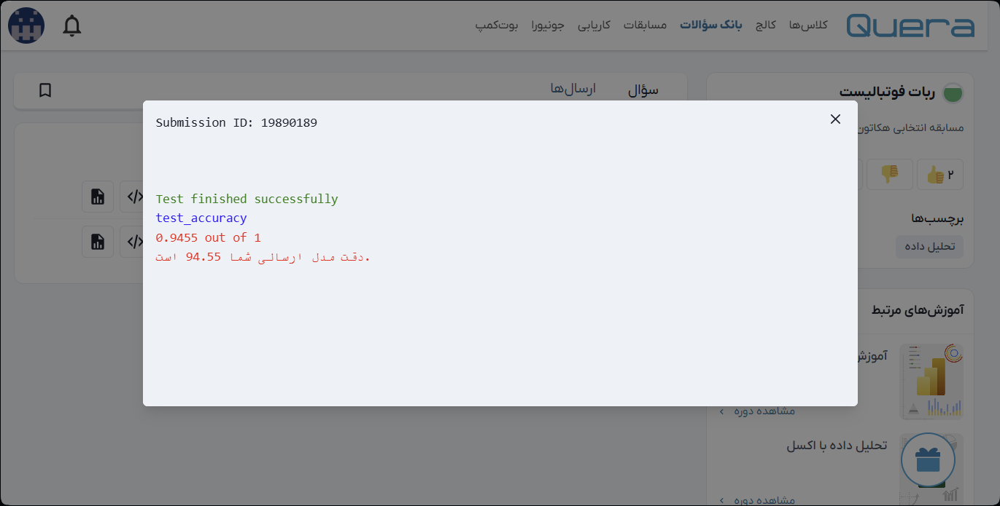

# 🤖 Footballist Robot — Heatmap Image Classification (Keras/TensorFlow)

این ریپو شامل راه‌حل من برای **یکی از سوالات مسابقات Quera** است. این پروژه با استفاده از **Keras/TensorFlow** روی داده‌های تصویری (Heatmap) مدل را آموزش می‌دهد و پس از داوری **نمره‌ی 94/100** گرفته است.

> 📌 **نکته:** این نوت‌بوک برای دانلود داده‌ها از **gdown** (Google Drive) استفاده می‌کند. اگر لینک شما عمومی نیست، یا از **Releases** گیت‌هاب/کگل استفاده کنید، یا داده را دستی در پوشه `data/` قرار دهید و مسیرها را نسبی کنید.

---

## 📂 ساختار پروژه
- `Footballist_Robot_(Quera_match).ipynb`: نوت‌بوک اصلی شامل:
  - دانلود داده با **gdown** و استخراج فایل فشرده
  - آماده‌سازی DataLoader با **ImageDataGenerator + flow_from_directory**
  - تعریف مدل **Sequential**
  - **آموزش** مدل (۲۰ epoch) و ارزیابی

---

## 🧰 تکنولوژی‌ها
- Python 3.x
- TensorFlow / Keras
- NumPy, Pandas
- Matplotlib
- gdown (دانلود از Google Drive)
- Pillow (برای کار با تصاویر)

---


## 📥 نصب و اجرا
1. مخزن را کلون کنید:

```bash
git clone https://github.com/evi-data-vision/Footballist-Robot-Quera.git
cd Footballist-Robot-Quera
pip install -r requirements.txt
```

---

## 🏆 درباره مسابقه (Quera)
- این نوت‌بوک راه‌حل یک سوال از مسابقات **Quera** است.
- **نمره‌ی دریافتی:** 94 از 100 پس از داوری سیستم.

   

---
